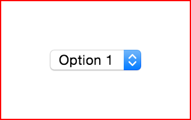
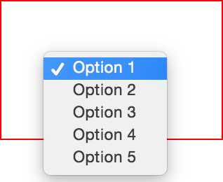
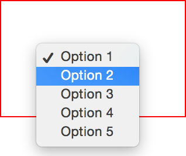
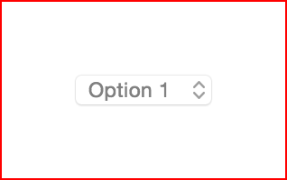

# Select

A component used to select a value from a short list of options.

## States

### Default

In it's default state, the select element displays the first option in the list.

### Open

When opened all the option list is visible.

### Open, Option Hover

The hovered option is styled differently.

### Option Selected

After clicking an option, the option list is closed and the selected value is
displayed.

### Disabled

Select component can be disabled.

## Examples

+ http://jsbin.com/veyogarivi/

## Libraries

NULL

## Similar

NULL
